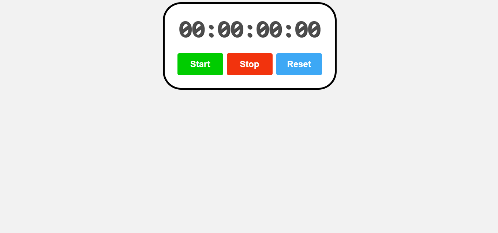

# ⏱ Stopwatch

Este é um projeto de **Cronômetro (Stopwatch)** desenvolvido em **React**, que permite iniciar, pausar e redefinir um contador de tempo. O tempo é exibido no formato **HH:MM:SS:MS** e atualizado em tempo real.

## 🛠 Tecnologias Utilizadas

- React.js  
- CSS Puro  

## 🎨 Funcionalidades

- Iniciar, pausar e redefinir o cronômetro.  
- Exibição precisa do tempo no formato **Horas:Minutos:Segundos:Milissegundos**.  
- Atualização dinâmica do tempo a cada 10ms.  
- Interface intuitiva com botões interativos.  

## 📷 Prévia do Projeto

